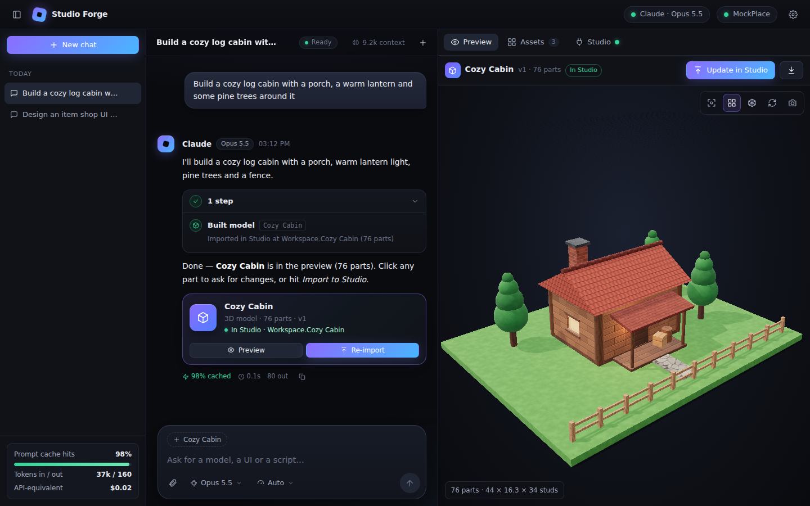
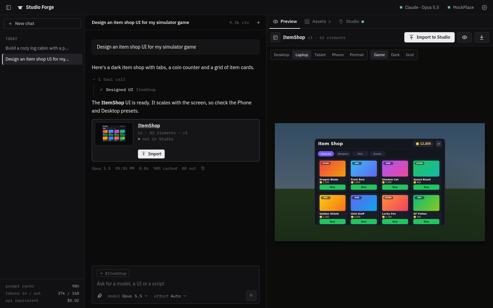
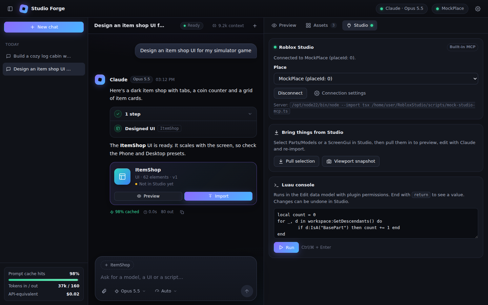
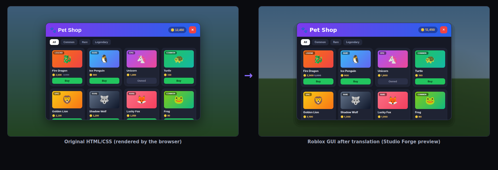

# Studio Forge

A dark-themed chat app that runs **Claude Code in the background** and connects it to **Roblox Studio** through Studio's MCP server. Ask for a 3D model, a UI, an animation, a visual effect, an ability (magic power or attack) or a script. You see it immediately in a live 3D viewer, a pixel-accurate UI preview, an animated rig or a live particle preview, and it goes into your open place with one click (or automatically).



| UI preview (Roblox layout rules) | Studio connection, pull selection, Luau console |
| --- | --- |
|  |  |

## What it does

- **Chat with Claude Code.** Claude Code runs as a background process with your own Claude account (Pro/Max subscription or API key). You watch it work live, like in Claude Code: thinking streams in, each tool call appears as `● Tool(args)` with a running timer, the Luau, HTML or shell command it is writing streams in as it is typed, tools report what they are doing ("Importing into Studio…", "Waiting for your approval…"), and results show underneath (output, diffs for file edits, the todo list). Click any call to see its full input and result. Every new or edited asset gets a card with Preview and Import buttons. Each reply shows its prompt-cache hit rate, time and output tokens, and the header shows the context size.
- **Auto-compact at the size you choose.** **Settings → General → Auto-compact** sets when Claude Code summarizes a long chat: off, 60k–500k tokens, any custom size, or Claude Code's default (about 784k on 1M-token models). Smaller keeps every reply faster and lighter on your plan; larger keeps more detail. The chat header shows the context against that point (click it to compact now), `/compact [what to keep]` in the message box does the same, and each compaction appears in the chat as a divider with the before/after size. It works through Claude Code's own settings (`CLAUDE_CODE_AUTO_COMPACT_WINDOW`, `CLAUDE_AUTOCOMPACT_PCT_OVERRIDE`), so the threshold Claude Code reports is the one you picked.
- **Live plan usage.** With a Claude subscription, the sidebar shows how much of your current 5-hour session and your weekly limits you have used, with countdowns to each reset. The numbers update with every request Claude makes (a green *live* marker shows while it works), the session percentage also sits next to the Claude status in the top bar, and a notice above the message box warns you when a limit is close or reached. **Settings → Claude account → Plan usage** shows every window and whether extra usage is on. The numbers come from Claude Code's own usage reports, the same ones as its `/usage` screen. *Check now* sends one tiny Haiku request to refresh them while you are idle.
- **A composer built for building.** Switch model and effort from the composer. Drop, paste or attach reference images, and attach the asset open in the preview so Claude knows which one you mean (`@asset`). Messages sent while Claude is working are queued and run in order; queued ones can be removed. <kbd>↑</kbd> edits your last message, <kbd>Esc</kbd> stops a reply, and any message can be copied, retried or edited and resent.
- **Command palette.** <kbd>Ctrl</kbd>/<kbd>⌘</kbd>+<kbd>K</kbd> searches chats and assets and runs actions: import, pull the Studio selection, connect Studio, switch model or effort, translate HTML, export. <kbd>/</kbd> focuses the message box and <kbd>?</kbd> lists every shortcut.
- **Animations for R15 and R6.** **Library → Animations** plays character animations live on the same dummies Studio's Rig Builder makes (grey block rig with a neutral face for R15, the classic smiling R6): pick R15 or R6, play, pause, scrub the timeline (keyframes are marked), change the speed and toggle looping. An R15 animation can be previewed on R6 too (it tells you which joints R6 doesn't have). Ask Claude for one ("a happy jump", "a sword combo") or add the starter set (idle, wave, walk, jump, R6 sword slash). Claude builds them from 22 named poses (guard, punch, kick, cast, jump, land, slash…) that it tweaks, mirrors to the other side and copies (a walk cycle is three short lines), adds follow-through so the head and arms trail the body, and every result reports knees or elbows bending backward, feet sinking into the floor or never touching it, and loops that jump. **To Studio** saves it as a KeyframeSequence where Studio's Animation Editor finds it (`ServerStorage.RBX_ANIMSAVES`) and adds an R15/R6 dummy to load it onto; the `.rbxmx` download can be dropped into Studio and published with *Save to Roblox*. The export is checked in Lune: posing the dummy through Roblox's Motor6D math gives exactly the preview.
- **Visual effects.** **Library → VFX** plays effects live with a glow (bloom) pass: particle emitters (textures, color and size over life, spread, shapes, acceleration, drag, spin, flipbooks, light emission, velocity-aligned sparks and flat shockwaves), beams, trails, fire, smoke, sparkles and lights. Mute single emitters, replay one-shot bursts, change the backdrop and speed. Mesh effects add solid shapes that grow, fade, change colour and spin: shock domes, collapsing cores, light pillars, rings racing over the ground and breathing forcefield shields. Ask Claude ("a fireball impact", "a blue portal", "rain") or add the ten starters (campfire, magic aura, explosion, portal, sword trail, lightning arc, snowfall, healing pickup, energy burst, force shield). Claude can start from any of them as a preset and recolour it with a tint. **To Studio** builds the effect where you're looking; **Attach** welds it to the part selected in Studio so it follows that part (sword trails). One-shots get an `EmitCount` attribute per emitter and a `Play` module: `require(effect.Play)()`. The `.rbxmx` download builds exactly the same instances (checked in Lune). With Roblox Studio installed, previews use Roblox's own built-in particle textures, read from your Studio install (a badge shows *Roblox textures*); custom `rbxassetid://` textures preview through Roblox's thumbnail service. Otherwise close stand-ins are drawn.
- **Abilities: preview magic powers before Studio.** **Library → Abilities** plays an animation on an R15/R6 dummy with effects timed to it: a charge on the hand during the windup, a fireball that flies from the hand and explodes where it lands, a lightning bolt in front of you, a shockwave when the fists hit the ground, a blade trail that follows the swing. Effects attach to a hand, the head, chest, feet, the ground under the character or the spot it stood on; projectiles fly with a velocity (and gravity) until they hit the ground, then play their impact. Abilities can also summon figures and bring props: a Stand that fades in behind your shoulder, rushes in front of you for a punch barrage and returns (its own animation, or mirroring yours in sync, in a ghostly ForceField or glowing Neon look with an aura), clones, a sword that grows in your hand, rock walls that rise out of the ground and sink back, thrown objects with an impact. Play, pause, scrub frame-exactly, slow it down to 0.1×, switch rig, and watch from the front, the side or behind. Ask Claude ("an ice spear throw", "a dash with a wind trail", "a Stand barrage") or add the nine starters (fireball, lightning strike, healing aura, ground slam, R6 frost nova, blade slash, Stand barrage, spirit sword, earth wall). **To Studio** adds `ReplicatedStorage.Abilities.<name>` (the animation, effect templates and a `Play` module: `require(…Play)(character)` casts it from any script) and a Tool in StarterPack, so you can press Play and click to cast it. Until you publish the animation (and put its id in the folder's `AnimationId` attribute), Studio plays it through a temporary id. The `.rbxmx` download is one self-contained Tool.
- **Claude looks at its own work.** After making or changing an animation, effect or ability, Claude can ask for frames drawn by the same preview engine (animations from the front and the side, on a stud grid, with the time on every frame; models from four sides) and fix what looks wrong before you see it. The frames are drawn by your open Studio Forge tab.
- **Any effect on a character.** In **Library → VFX**, *On character* plays the effect attached to a body part of an R15/R6 dummy while any animation from your library runs; *Save as ability* turns that into an ability.
- **A library for each game.** The **Library** tab keeps your models, animations, effects and abilities in four tabs, organized by game: each Roblox Studio place you open becomes a game automatically, and everything Claude builds, everything you import and every Studio selection you save is filed under the game that was open. Switch games or view all of them, search by name, and hover a model to see it turn around. Previews are cached, so a big library opens instantly. Move assets between games, rename, import or download them from each card. Claude's `list_assets` shows the open game's assets first, so large libraries cost fewer tokens.
- **Version history.** Every edit to an asset is kept (the last 25 versions). Open the version label in the preview header to restore an earlier one; restoring creates a new version, so nothing is lost.
- **Run Luau from a reply.** Luau code blocks in Claude's replies have a *Run in Studio* button that shows the output inline.
- **Chat tools.** Rename, export as Markdown or delete a chat from its header menu. The browser tab title shows when Claude is working and when a reply finished in the background.
- **3D models.** Claude describes models as Roblox parts (blocks, balls, cylinders, wedges, 40+ materials, lights, sub-groups). The viewer renders them with Roblox-style materials and shadows, mostly matte like in Studio, and only Neon parts glow. Click any part to inspect it or say "change this part".
- **HTML → Roblox UI translation.** Claude (or you) designs a UI in plain HTML/CSS. Studio Forge renders it in the browser at the design resolution and turns every element into a Roblox GuiObject at exactly the same position. Backgrounds, gradients, corners, borders, shadows, text, rich text, buttons, inputs, images, scrolling lists, `::before`/`::after` and list bullets all carry over. Elements stay anchored to their screen edge or centre, and the whole UI scales proportionally on phones, tablets and 4K. See [HTML → Roblox](#html--roblox-ui-translation).
- **UIs that match Studio.** Claude can also build ScreenGuis from a compact Roblox-native spec (UDim2, AnchorPoint, UICorner, UIStroke, UIGradient, UIPadding, list/grid layouts, AutomaticSize, ScrollingFrames, rich text). The browser preview re-implements Roblox's layout rules and has Desktop/Laptop/Tablet/Phone frames, so what you see is what Studio gets.
- **Scripts go straight into Studio.** Claude writes Script, LocalScript and ModuleScript (one or a whole feature's worth per call) directly into the place; a script with the same name in the same place is updated in place. Scripts aren't kept in the library. UIs live in the preview, with your recent models and UIs one click away under the clock button.
- **Lands where you're looking.** New models are placed on the surface in the middle of the Studio view (or straight ahead when you look at the sky), snapped to whole studs and turned to face you. Turn the facing off, or place at the origin or at the designed coordinates, in **Settings → Import**.
- **One-click import (or auto-import).** Assets are converted to Luau deterministically and run through the Studio MCP. Imports are **undoable** (ChangeHistoryService). Re-importing **updates the previous copy in place**, keeping its position, and the new object is selected in Studio.
- **Export and import.** Download any asset as `.rbxmx` (drag into Studio), `.luau` (paste into the command bar) or `.json`. Pull the current Studio selection (Parts/Models or GUIs) back into the app, let Claude improve it, then push it back.
- **Browse your Studio place.** The **Place** tab shows Studio's Explorer for the open place, read live through the Studio MCP: every service, folder, model, part, GUI and script, with part counts. Click a model, a folder or **Map** to see it in 3D (the baseplate, every part and the terrain with its water; maps with tens of thousands of parts stay smooth). ScreenGuis open in the UI preview, and scripts open as highlighted code. From any of them you can select it in Studio, ask Claude about it, or save a copy to your assets so Claude can edit it.
- **Studio tools for Claude, one round trip per job.** `studio_query` finds instances by path, class, name, tag or attribute and reads any properties, plus size and center (`Bounds`), part counts and script lengths (or prints an outline of a folder or the whole place). `studio_edit` applies a batch of operations as one undo step: set, create, delete, clone, move, group/ungroup, weld (one rigid body, optionally unanchored), scale, insert a Creator Store model by id (placed where you're looking, and it tells Claude if the model contains scripts), point your camera at something, and select. JSON values are converted to each property's type, and bulk edits go through a query, like recoloring every part named "Leaf". `"@selection"` targets whatever you have selected in Studio. `studio_scripts` reads several scripts at once (or just a range of lines) with line numbers and searches the source of every script; `studio_script_patch` edits several scripts in one call with exact find/replace edits. `studio_audit` checks the place for what breaks or slows a game: unanchored parts with nothing holding them, parts that fall out of the world, LocalScripts in places where they never run, `LocalPlayer` in server scripts, deprecated APIs (`wait`, `spawn`, `:connect`, BodyMovers), invisible colliders, duplicate parts, the heaviest models and a missing SpawnLocation. `studio_lighting` applies a mood preset (day, sunset, night, overcast, foggy, neon, spooky) with Atmosphere, Bloom, ColorCorrection and SunRays. `studio_terrain` fills shapes, swaps materials and generates rolling hills with water. `studio_playtest` starts a play-test, lets it run, reports errors and warnings first, then stops. `studio_undo` reverts Claude's last steps. Claude can also run Luau, inspect instances and take viewport screenshots it can see. Luau and script edits ask for your approval first (configurable).
- **Faster replies.** When a chat's Claude Code isn't running yet (a new session, or after 20 idle minutes), it starts while you type, so the first words of the reply arrive about a second sooner. Each message carries one short line about what you have selected in Studio and what the camera is looking at, read while Claude Code starts up, so "make this red" or "put a tree here" needs no lookup call (only sent when it changed; turn it off under **Settings → General**). Lookups are marked read-only, so Claude Code can run several of them at the same time.
- **Faster games.** On import, touching identical blocks are merged (fewer parts, same look). Parts are anchored, CanTouch is turned off, and tiny or neon parts skip shadows.

## HTML → Roblox UI translation



Ask Claude for a UI and it designs it in HTML/CSS (`create_ui_html`). You can also paste or open any `.html` file under **Library → + → Translate HTML**. The page is rendered by your browser at the design size (1280×720 by default) with scripts disabled. The translator then reads the browser's **computed** layout and styles, so flexbox, grid, margins, percentages and fonts are resolved exactly as the browser shows them.

| HTML / CSS | Roblox |
| --- | --- |
| `div` with background / gradient | `Frame` + `UIGradient` (angle and color stops kept) |
| `border-radius` | `UICorner` (pills and circles stay round when scaled) |
| uniform `border`, `outline` | `UIStroke` (the frame is inset so the outer edge matches) |
| single-side borders (`border-bottom`) | thin divider `Frame`s |
| `box-shadow` | soft layered shadow frames that move with the element |
| text (font, size, weight, color, alignment, `uppercase`, ellipsis, `text-shadow`) | `TextLabel` with matching `FontFace`, `TextTruncate` and `TextStroke` |
| `<b>`, `<i>`, `<u>`, `<s>`, `<span style="color/font-size">` | RichText |
| `<button>`, `<a href>`, `<select>` | `TextButton` |
| `<input>`, `<textarea>` (placeholder) | `TextBox` |
| ``, `background: url(rbxassetid://…)` | `ImageLabel` (`object-fit` → `ScaleType`) |
| `overflow: hidden` / `auto` | `ClipsDescendants` / `ScrollingFrame` with the right canvas |
| `transform: rotate()`, `opacity` | `Rotation`, transparency |
| `::before` / `::after`, list bullets, `<progress>`, checkboxes | real instances |
| `id="BuyButton"` / `data-name` | the Instance name, so scripts can find it |

**Works on every screen.** Elements touching an edge or centred on screen are anchored there (AnchorPoint + scale), full-width bars use scale sizes, and groups move together. The translated ScreenGui gets an `AutoScaleRoot` with a `UIScale` and a 15-line LocalScript that scales the design proportionally to the player's screen. The preview has a **Design** preset plus phone, tablet and desktop presets, and a **Roblox result / Original HTML** toggle for comparing them.

**Not translated:** JavaScript, SVG, canvas, video, hover states and animations (the translation is a static snapshot), CSS filters and backdrop blur, and images that aren't Roblox assets. The page background is treated as the game world and isn't exported. Text is capped at 100px, Roblox's maximum. The translator tells you when it skips something.

Example pages to try are in `examples/html/`.

## Designed to use fewer tokens

| Technique | Effect |
| --- | --- |
| Compact JSON asset specs instead of Luau or HTML | Claude writes roughly 3–5× fewer output tokens per model or UI |
| Deterministic conversion and import on the server | Converting and importing costs no tokens |
| `edit_model` / `edit_ui` partial edits, `edit_ui_html` find/replace edits | Changing one part or one CSS rule doesn't re-send the whole asset |
| Auto-import reports inside the create/edit result | No extra tool round-trip to import |
| One long-lived Claude Code process per chat, static system prompt and tool list, `--exclude-dynamic-system-prompt-sections` | The prompt prefix stays byte-identical, so after the first turn prompt caching serves most input (91% of input tokens in a test run) |
| Optional 1-hour prompt cache | Coming back from testing in Studio doesn't re-pay the whole context |
| "Studio (lean)" tool mode | Built-in Claude Code tools are left out of the prompt unless you choose "Full Claude Code" |
| Short asset ids, terse tool results, Studio results capped | Keeps tool traffic small |
| Spec shorthand: shared `styles`, `repeat`, `copies` and group `clones` (models), `styles` (UIs), expanded on the server | Claude writes repetitive builds once. In a test run, Claude sent 3.2 KB for a 78-part farm scene whose full spec is 9.4 KB (66% less to generate) |
| `get_asset` returns the create format with repeated looks folded into styles, and can read one group or a few parts/nodes | Reading a model back costs ~13% fewer tokens (UIs ~20%), far less when only part of it is needed; models over 600 parts return a group outline first |
| Positioning checks in every create/edit result (floating parts, a part below the ground that would lift the model, z-fighting faces, duplicates) | Claude fixes build mistakes in the next edit instead of the user finding them in Studio |
| Slim tool schemas: no regex/length noise, edit tools refer to the create tools' formats, built once | The list of 32 tools stays around 9k tokens and comes from the prompt cache after the first turn; calls are still validated against the full schemas |
| Studio tools that do a whole job in one call (`studio_query` with properties, batched `studio_edit`, `studio_scripts` grep and multi-script reads, `studio_script_patch`, `create_script` with many scripts, `studio_playtest`, `studio_audit`) | Fewer turns: what took a search, several inspects and one edit per instance is one call with a compact text result |
| Effect presets: a whole effect (`{"preset": "explosion", "tint": "#3fa0ff", "scale": 0.5}`) or one emitter (`{"type": "particles", "preset": "flames", "rate": 20}`), also inside abilities | A tuned effect is one short line instead of hundreds of tokens of emitter settings; `tint` recolors a whole effect or ability by hue |
| Named poses (`{"t": 0.2, "pose": "punch"}`), mirrored and copied keyframes, automatic follow-through | A punch combo or a walk cycle is a few short lines, with the joint signs right |
| Bulk edits: `updateWhere` (by group, material, color, type or a name pattern) and `recolor` (`{"#old": "#new"}`) in `edit_model` and `edit_ui` | "Make the roof slate" or "switch the accent to green" is one small call, not one update per part |
| Studio selection and camera focus sent with each message (when they changed), read-only tools run in parallel | "This" needs no lookup round trip, and several lookups cost one wait |
| Auto-compact at a size you choose (default 200k) | Long chats stay small and fast instead of re-reading up to ~784k tokens of context every turn |
| Lean import Luau: Roblox defaults are left out, constructors and fonts are shared, part flags are packed, models move with native `Model:PivotTo` | Scripts sent to Studio are 18–44% smaller (item shop UI 44.6 → 24.9 KB, cabin 14.9 → 12.2 KB), so they compile and run faster |

## Requirements

- **Node.js 20+**
- **Claude Code CLI**: `npm i -g @anthropic-ai/claude-code` (or the native installer)
- **Roblox Studio** (Windows or macOS) with the built-in MCP server enabled. The app also runs without Studio: you can still preview, chat and download `.rbxmx` files.

## Quick start

```bash
git clone https://github.com/PELOS932/RobloxStudio.git
cd RobloxStudio
npm install
npm start          # builds the web app and serves it at http://localhost:4317
```

Or double-click **`start.bat`** (Windows) or run **`./start.sh`** (macOS/Linux).

### 1. Connect your Claude account

Open **Settings → Claude account → Sign in with Claude subscription**. This runs Claude Code's own `claude auth login` flow and shows its sign-in link. Alternatively:

- run `claude auth login` once in a terminal, or
- put `CLAUDE_CODE_OAUTH_TOKEN` (from `claude setup-token`) or `ANTHROPIC_API_KEY` in a `.env` file (see `.env.example`).

Studio Forge never sees or stores your credentials. Claude Code handles authentication.

> Studio Forge is meant to run locally for **your own** use with your own Claude account. If you share it with other people, each person should use their own Claude Code login or API key.

### 2. Connect Roblox Studio

1. Open a place in Roblox Studio.
2. Open **Assistant → … → Manage MCP Servers** and turn on **Enable Studio as MCP server**.
3. In Studio Forge, open the **Studio** tab and press **Connect**.

Studio Forge finds Studio's `StudioMCP` executable automatically:
- Windows: `%LOCALAPPDATA%\Roblox\Versions\version-*\StudioMCP.exe`, falling back to `mcp.bat`
- macOS: `/Applications/RobloxStudio.app/Contents/MacOS/StudioMCP`

If it isn't found, set the command in **Settings → Roblox Studio**. The older [studio-rust-mcp-server](https://github.com/Roblox/studio-rust-mcp-server) plugin also works: use the path to `rbx-studio-mcp` with the argument `--stdio`. With the old plugin, only Luau execution, console output and play-test are available.

## How it works

```
Browser (React + three.js)  ⇄  WebSocket/REST  ⇄  Studio Forge server (Node, localhost only)
                                                   │
                     claude -p --input-format stream-json --output-format stream-json
                     (one long-lived process per chat, your Claude account)
                                                   │  HTTP MCP: "forge" tools
                                                   ▼
                     Forge MCP server ── deterministic converters (spec → Luau / .rbxmx)
                                                   │  stdio MCP client
                                                   ▼
                                     Roblox Studio built-in MCP (StudioMCP → Studio)
```

- `src/shared`: asset specs (zod), converters (`to-luau.ts`, `to-rbxmx.ts`), the part-merging optimizer and the Luau that reads selections back out of Studio. Used by both server and browser, so previews and imports come from the same code.
- `src/server`: Claude Code process manager (`claude.ts`), Forge MCP tools (`forge-mcp.ts`), Studio MCP client (`studio-bridge.ts`), storage and HTTP/WebSocket.
- `src/web`: the UI, including the 3D viewer (`ModelViewer.tsx` and `lib/materials.ts`), the Roblox layout engine for UI previews (`lib/ui-layout.ts`) and the HTML translator (`lib/html-to-ui.ts`). Translation needs a real browser layout engine, so when Claude calls `create_ui_html` the server asks your open Studio Forge tab to do it.
- Your chats, assets and settings are stored in `data/` (gitignored).

### Asset formats (what Claude writes)

```jsonc
// Model: one entry per part; Y is up and units are studs
{ "name": "Lamp", "parts": [
  { "name": "Pole", "shape": "cylinder", "axis": "y", "size": [0.4, 6, 0.4], "pos": [0, 3, 0], "material": "Metal", "color": "#222428" },
  { "name": "Bulb", "shape": "ball", "size": [1, 1, 1], "pos": [0, 6.5, 0], "material": "Neon", "color": "#ffcc66",
    "light": { "type": "point", "range": 16 } } ] }

// Effect: emitters around one root on the ground; sequences are n, [from, to] or [[t, v], …]
{ "name": "Campfire", "emitters": [
  { "name": "Flames", "type": "particles", "pos": [0, 0.4, 0], "texture": "fire", "color": ["#ffd36b", "#a8200a"],
    "size": [1.4, 0.4], "transparency": [[0, 0.3], [1, 1]], "lifetime": [0.6, 1.1], "rate": 45, "speed": [2, 4], "lightEmission": 1 },
  { "name": "Glow", "type": "light", "pos": [0, 1.5, 0], "color": "#ff9a4a", "brightness": 2.5, "range": 16 } ] }

// …or start from a preset and change only what differs
{ "preset": "campfire", "name": "Spirit Fire", "tint": "#5fd0ff",
  "emitters": [{ "name": "Wisps", "type": "particles", "preset": "motes", "pos": [0, 2, 0] }] }

// Mesh effect: grows, fades, spins
{ "name": "Dome", "type": "mesh", "shape": "sphere", "material": "neon", "color": "#9fe8ff", "size": 1, "to": 16, "life": 0.5 }

// Ability: an animation (inline or an a_… id) plus effects on cue (inline or v_… ids), summons and props
{ "name": "Fireball", "rig": "R15", "animation": { "loop": false, "keyframes": [ /* windup, throw, recover */ ] },
  "events": [
    { "name": "Charge", "at": 0, "attach": "rightHand", "duration": 0.45, "vfx": { "emitters": [ /* … */ ] } },
    { "name": "Fireball", "at": 0.45, "attach": "rightHand", "travel": { "velocity": [0, -2.5, -48] }, "duration": 1.4,
      "vfx": { "emitters": [ /* … */ ] }, "impact": { "emitters": [ /* … */ ] } } ],
  "summons": [ { "name": "Stand", "at": 0.1, "animation": { "keyframes": [ /* punch barrage */ ] }, "material": "ForceField",
    "path": [ { "t": 0.4, "offset": [0.6, 0.4, -2.8] } ], "vfx": { "preset": "magicAura", "scale": 0.4 } } ],
  "props": [ { "at": 0, "attach": "rightHand", "appear": "grow", "model": { "parts": [ /* a blade along -z */ ] } } ] }

// UI: flat node list, children reference their parent by name
{ "name": "HUD", "nodes": [
  { "name": "Panel", "type": "Frame", "pos": [0, 16, 1, -16], "anchor": [0, 1], "size": [0, 260, 0, 64], "bg": "#15161c", "corner": 12 },
  { "name": "Coins", "parent": "Panel", "type": "TextLabel", "size": [1, 0, 1, 0], "text": "🪙 1,250", "font": "GothamBold", "textSize": 24 } ] }
```

The `examples/` folder has a 76-part cabin and a full item-shop UI (add them with **Library → + → Paste a JSON spec**), the starter animations and effects, plus HTML pages in `examples/html/` (add them with **Library → + → Translate HTML**).

## Security

- The server listens on `127.0.0.1` only and rejects requests whose `Host` or `Origin` isn't the app itself. This blocks other websites and DNS rebinding.
- Claude Code reaches the Forge MCP endpoint with a random per-launch bearer token.
- Running Luau or editing scripts in Studio shows an Allow/Deny dialog unless you turn on auto-approve. In Full mode, risky Claude Code tools (shell commands, for example) use the same dialog.

## Development

```bash
npm run dev        # API server with reload + Vite dev server on http://localhost:5173
npm test           # converter tests + end-to-end test
npm run typecheck
```

The tests that execute generated Luau need [Lune](https://lune-org.github.io/docs) (`cargo install lune`) and are skipped without it.
- Every starter ability is imported with its Luau and loaded from its `.rbxmx`; both must build the same KeyframeSequence (pose for pose), the same effect templates, summon rigs (parts, Motor6Ds) and props, and `Play`/`Cast` scripts that compile. Casting runs the `Play` module in Lune: the Stand must appear behind the right shoulder, rush in front of the caster, come back and leave on time; the Earth Wall pillars must rise out of the ground and stand on it; the spirit blade must sit in the right hand; a mesh shock dome must grow to about 16 studs and hide again. The `Play` module is then actually run on a dummy in Lune with a simulated clock (task.delay, Heartbeat, Debris and raycasts against a ground plane): the Fireball must charge on the hand, leave it at 0.45 s, land about 37 studs ahead and explode there, with every effect cleaned up and no script errors.
- Every model, UI, script, animation and starter effect is converted both ways: generated Luau is executed against Roblox's instance model in Lune, the `.rbxmx` export is deserialized, and the two resulting instance trees must match property for property.
- The end-to-end test starts the real server with a fake Claude Code CLI (`test/fake-claude.mjs`) and a mock Studio MCP server (`scripts/mock-studio-mcp.ts`, which runs Luau in Lune against a persistent place file).
- Every named pose is checked for joints bending the wrong way and feet off the floor, and the pose sheets were checked by eye from the front and the side.
- The HTML translation test drives a real Chromium (via `playwright-core`; set `CHROMIUM_PATH` if it isn't found, otherwise it's skipped). It translates `test/html/hud.html` through the `create_ui_html` tool, checks anchoring, names and styling, applies an `edit_ui_html` edit, and confirms the result builds identical instances via Luau and `.rbxmx`. The same browser draws the frame sheets Claude looks at (an animation, an ability with a summon and a prop, a model) and their size and layout are checked.
- The Studio power tools run against the mock Studio in Lune (batched edits, queries, `@selection`, group/weld/scale, script search, reads and patches, the audit, lighting, the context line sent with messages); terrain generation runs against a recording stand-in for `Terrain` because Lune has no voxel engine. Camera focus and Creator Store inserts need a real Studio.
- You can point **Settings → Roblox Studio** at `npm run mock-studio` to try the app without Studio.

## Troubleshooting

- **"Claude Code X does not support this model; version Y or newer is required."** New Claude models need a recent Claude Code. Click **Update Claude Code** under the error (or **Settings → Claude account → Update**, or run `claude update` in a terminal), then **Try again**. Open chats switch to the new version with their next message. If the update fails because of permissions, run `npm i -g @anthropic-ai/claude-code@latest` in a terminal (as administrator on Windows), or pick another model in the composer.

## Status and limitations

- Not yet tested against a live Roblox Studio. Conversions are verified with Lune (Roblox's reflection database): 3D models are imported part by part and checked against Roblox's own `CFrame.Angles` math (every shape, cylinder axis, rotation, material, light and group), then pulled back and re-imported to the same parts. The Studio MCP integration follows the tool schemas of Studio's built-in server and was exercised against the mock server. Please report anything that behaves differently in real Studio.
- The UI preview uses Roblox's layout rules exactly. Roblox's own fonts (Gotham, Builder Sans) are proprietary, so the preview approximates them with Montserrat and Inter. Text widths can differ slightly, and HTML text is mapped to the closest Roblox font (Inter → Builder Sans, Montserrat → Gotham, and so on).
- HTML translation is a faithful snapshot of the rendered page, not a live layout. Lists built from HTML use absolute positions, not `UIListLayout`. Layered frames only approximate soft shadows.
- Image previews load `rbxassetid://` thumbnails through Roblox's public thumbnail API. Unknown ids show a placeholder.
- The VFX preview simulates Roblox's particle rules closely but not exactly: the built-in Roblox particle textures are redrawn approximations, cylinder and disc shapes follow the documented behaviour as best understood, and Fire/Smoke/Sparkles are approximated with particles. Custom `rbxassetid://` textures preview as a soft glow.
- Terrain generation and `studio_playtest` haven't been run in real Studio yet (Lune can't execute them).
- Abilities run their effects where `Play` is called (the server, for the included Tool), with attached and flying effects moved every Heartbeat. That is ideal for trying them; a production game would usually play the visuals on each client. The preview and Studio share the same timing and placement rules, but the preview's projectile starts from the animated hand, while in Studio it starts from wherever the hand really is at that moment.
- Parts only (no MeshParts or unions). Pulling a selection skips unsupported objects and lists them.
- The Place tab shows a snapshot (press reload to read Studio again). MeshParts and unions are drawn as their bounding boxes, because their geometry can't be downloaded without your Roblox credentials. Decals, textures, particles and lights aren't drawn. Terrain is a height map sampled from above (so caves and overhangs are missing), within 4096 studs of the origin.
